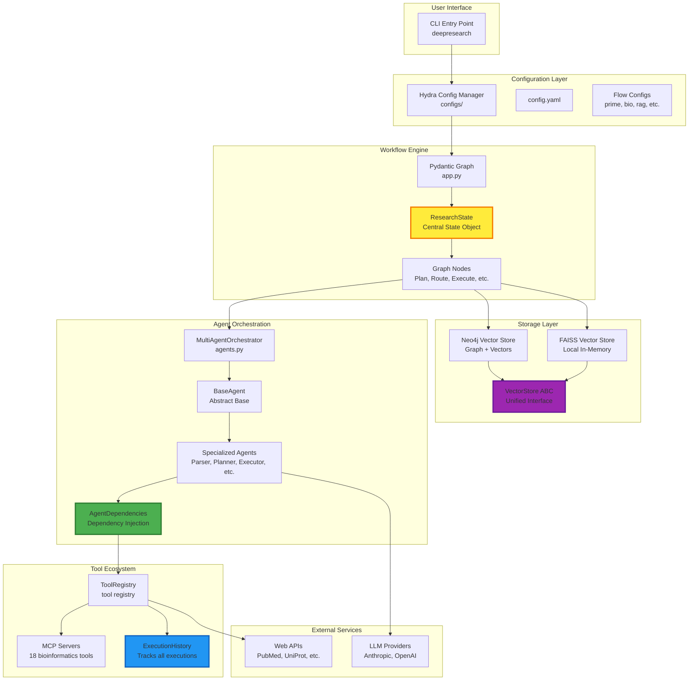
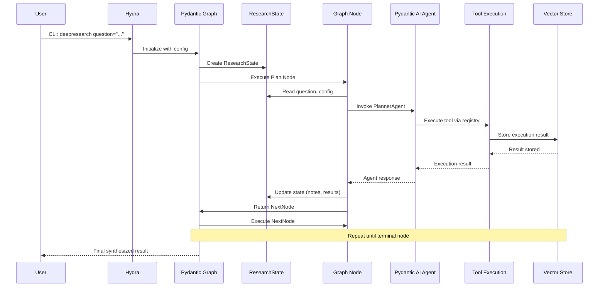
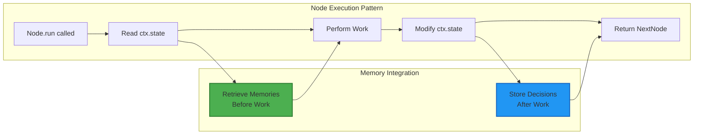
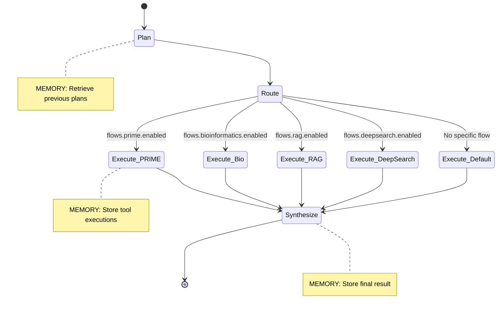

# Phase 1: Baseline Codebase Foundation Spec
## Memory System Integration Points - DeepCritical/DeepResearch

**Status**: 🚧 In Review - Seeking Senior Approval
**Date**: 2025-11-19
**Purpose**: Comprehensive mapping of ALL integration points for memory system implementation
**Related Issue**: [#31 - Add Agent Memory and Workflow Context Management](https://github.com/DeepCritical/DeepCritical/issues/31)

---

## Table of Contents

1. [Executive Summary](#executive-summary)
2. [Current Architecture Overview](#current-architecture-overview)
3. [State Management Patterns](#state-management-patterns)
4. [Agent Architecture (Pydantic AI)](#agent-architecture-pydantic-ai)
5. [Workflow Patterns (Pydantic Graph)](#workflow-patterns-pydantic-graph)
6. [Configuration Structure (Hydra)](#configuration-structure-hydra)
7. [Existing Storage Backends](#existing-storage-backends)
8. [Tool Ecosystem](#tool-ecosystem)
9. [Testing Infrastructure](#testing-infrastructure)
10. [Memory Integration Points Map](#memory-integration-points-map)
11. [Recommendations](#recommendations)

---

## Executive Summary

DeepCritical/DeepResearch is a **Hydra + Pydantic Graph + Pydantic AI multi-agent system** with:
- **~379 Python files** across the repo (including tests)
- **Dozens of tools**, including **18 MCP bioinformatics servers**
- **Vector stores implemented**: Neo4j and FAISS (other backends are referenced in docs/configs but not implemented here)
- **Multiple workflows**: default/search, challenge, PRIME, Bioinformatics, RAG, DeepSearch, Enhanced/Primary REACT orchestration, plus workflow-pattern statemachines
- **Many specialized agents** (e.g., Parser, Planner, Executor, Bioinformatics, DeepSearch, Orchestrator, RAG, DeepAgent variants)

**Key Finding**: The architecture already has **natural integration points** for memory at every layer:
- **State Layer**: `ResearchState` flows through graph nodes
- **Agent Layer**: `AgentDependencies` for dependency injection
- **Tool Layer**: `ExecutionHistory` tracks all tool executions
- **Storage Layer**: Unified `VectorStore` abstract interface
- **Config Layer**: Hierarchical Hydra composition

**Memory System Can Integrate Without Refactoring** - All hooks already exist.

---

## Current Architecture Overview

### High-Level System Architecture



### Data Flow Through System (conceptual)



---

## State Management Patterns

### ResearchState - The Central State Object

**Location**: `DeepResearch/app.py:45-96`

```python
@dataclass
class ResearchState:
    """Central state object for research workflow execution."""

    # ===== CORE FIELDS =====
    question: str
    plan: list[str] | None = field(default_factory=list)
    full_plan: list[dict[str, Any]] | None = field(default_factory=list)
    notes: list[str] = field(default_factory=list)
    answers: list[str] = field(default_factory=list)

    # ===== PRIME-SPECIFIC =====
    structured_problem: StructuredProblem | None = None
    workflow_dag: WorkflowDAG | None = None
    execution_results: dict[str, Any] = field(default_factory=dict)

    # ===== ORCHESTRATION STATE =====
    config: DictConfig | None = None
    orchestration_config: WorkflowOrchestrationConfig | None = None
    orchestration_state: OrchestrationState | None = None
    spawned_workflows: list[str] = field(default_factory=list)
    multi_agent_results: dict[str, Any] = field(default_factory=dict)

    # ===== ENHANCED REACT ARCHITECTURE =====
    app_configuration: AppConfiguration | None = None
    agent_orchestrator: AgentOrchestrator | None = None
    nested_loops: dict[str, Any] = field(default_factory=dict)
    active_subgraphs: dict[str, Any] = field(default_factory=dict)
    break_conditions_met: list[str] = field(default_factory=list)
    loss_function_values: dict[str, float] = field(default_factory=dict)
    current_mode: AppMode | None = None
```

### Memory Integration Point #1: Add Memory Fields to ResearchState

```python
# PROPOSED ADDITIONS (types to be defined)
@dataclass
class ResearchState:
    # ... existing fields ...

    memory_session_id: str | None = None
    memory_client: MemorySystemClient | None = None  # proposed injectable handle
    memory_config: MemoryConfig | None = None        # proposed per-run settings
```

**Rationale**:
- `memory_session_id`: Unique identifier for this workflow run (enables cross-run retrieval)
- `memory_client`/`memory_config`: Hook for workflow-scoped memory access

---

### Alternative State Classes

#### DeepAgentState
**Location**: `DeepResearch/src/datatypes/deep_agent_state.py`

```python
class DeepAgentState(BaseModel):
    session_id: str
    todos: list[Todo] = Field(default_factory=list)
    files: dict[str, FileInfo] = Field(default_factory=dict)
    current_directory: str = Field("/", description="Current working directory")
    active_tasks: list[str] = Field(default_factory=list)
    completed_tasks: list[str] = Field(default_factory=list)
    conversation_history: list[dict[str, Any]] = Field(default_factory=list)
    shared_state: dict[str, Any] = Field(default_factory=dict)
    metadata: dict[str, Any] = Field(default_factory=dict)
    created_at: datetime = Field(default_factory=datetime.now)
    updated_at: datetime | None = None
```

**Memory Integration Opportunity**: `conversation_history` and `shared_state` are natural memory candidates.

#### RAGState
**Location**: `DeepResearch/src/statemachines/rag_workflow.py`

```python
@dataclass
class RAGState:
    question: str
    rag_config: RAGConfig | None = None
    documents: list[Document] = field(default_factory=list)
    rag_response: RAGResponse | None = None
    rag_result: dict[str, Any] | None = None
    processing_steps: list[str] = field(default_factory=list)
    errors: list[str] = field(default_factory=list)
    config: DictConfig | None = None
    execution_status: ExecutionStatus = ExecutionStatus.PENDING
```

**Memory Integration Opportunity**: `documents` field already stores retrievable data.

---

### State Flow Through Pydantic Graph Nodes



**Example Node Pattern (with proposed memory hooks)**:
```python
@dataclass
class PlanNode(BaseNode[ResearchState]):
    async def run(self, ctx: GraphRunContext[ResearchState]) -> NextNode:
        # 1. Read state
        question = ctx.state.question
        config = ctx.state.config

        # 2. MEMORY INTEGRATION (proposed): Retrieve relevant context
        if ctx.state.memory_client:
            memories = await ctx.state.memory_client.retrieve(
                query=question,
                filters={"agent_type": "planner"},
                top_k=3,
                session_id=ctx.state.memory_session_id,
            )
            context = "\n".join(m.content for m in memories)
        else:
            context = None

        # 3. Perform work
        planner_agent = PlannerAgent(...)
        plan = await planner_agent.run(question, context=context)

        # 4. Modify state
        ctx.state.plan = plan
        ctx.state.notes.append(f"Plan created with {len(plan)} steps")

        # 5. MEMORY INTEGRATION (proposed): Store decision
        if ctx.state.memory_client:
            await ctx.state.memory_client.store(
                content=f"Plan: {plan}",
                metadata={
                    "node": "PlanNode",
                    "question": question,
                    "timestamp": datetime.now().isoformat(),
                    "session_id": ctx.state.memory_session_id,
                },
            )

        # 6. Return next node
        return ExecuteNode()
```

---

## Agent Architecture (Pydantic AI)

### BaseAgent Pattern

**Location**: `DeepResearch/agents.py`

```python
class BaseAgent(ABC):
    def __init__(
        self,
        agent_type: AgentType,
        model_name: str = "anthropic:claude-sonnet-4-0",
        dependencies: AgentDependencies | None = None,
        system_prompt: str | None = None,
        instructions: str | None = None,
    ):
        self.agent_type = agent_type
        self.model_name = model_name
        self.dependencies = dependencies or AgentDependencies()
        self._agent: Agent[AgentDependencies, str] | None = None
        self._initialize_agent(system_prompt, instructions)

    def _initialize_agent(self, system_prompt: str | None, instructions: str | None):
        try:
            self._agent = Agent[AgentDependencies, str](
                self.model_name,
                deps_type=AgentDependencies,
                system_prompt=system_prompt or self._get_default_system_prompt(),
                instructions=instructions or self._get_default_instructions(),
            )
            self._register_tools()
        except Exception:
            self._agent = None

    @abstractmethod
    def _register_tools(self):
        """Register tools with the agent."""
        pass
```

### Memory Integration Point #2: AgentDependencies

**Location**: `DeepResearch/src/datatypes/agents.py` (dataclass near top)

**Current Implementation**:
```python
@dataclass
class AgentDependencies:
    """Dependencies injected into Pydantic AI agents."""
    config: dict[str, Any] = field(default_factory=dict)
    tools: list[str] = field(default_factory=list)
    other_agents: list[str] = field(default_factory=list)
    data_sources: list[str] = field(default_factory=list)
```

**Proposed Enhancement**:
```python
@dataclass
class AgentDependencies:
    """Dependencies injected into Pydantic AI agents."""
    # keep existing fields
    config: dict[str, Any] = field(default_factory=dict)
    tools: list[str] = field(default_factory=list)
    other_agents: list[str] = field(default_factory=list)
    data_sources: list[str] = field(default_factory=list)

    # ===== MEMORY SYSTEM FIELDS (NEW - PROPOSED) =====
    memory_client: MemorySystemClient | None = None
    memory_config: MemoryConfig | None = None
    session_id: str | None = None
    agent_profile: AgentProfile | None = None
```

**Rationale**:
- `memory_client`: Access to memory system (retrieve, store)
- `memory_config`: Agent-specific memory settings (top_k, filters, etc.)
- `session_id`: Link memories to workflow session
- `agent_profile`: Mario's Profile concept (BioinformaticsAgent priorities: papers > genes)

---

### Specialized Agent Types

**Agent classes found (examples)**:
1. **ParserAgent** - Parses user questions
2. **PlannerAgent** - Creates execution plans
3. **ExecutorAgent** - Executes tool-based plans
4. **SearchAgent** - Web search coordination
5. **RAGAgent** - Retrieval-augmented generation
6. **BioinformaticsAgent** - Multi-source bio data fusion
7. **DeepSearchAgent** - Deep web research
8. **EvaluatorAgent** - Result evaluation
9. **DeepAgentVariants** (5 types): Basic, Enhanced, Comprehensive, Experimental, Production

**Memory Needs Per Agent Type (illustrative/inferred)**:

| Agent Type | Memory Priorities | Top-K | Retrieval Strategy |
|------------|------------------|-------|-------------------|
| BioinformaticsAgent | papers, genes, blast_results | 15 | Hybrid (semantic + metadata) |
| PRIMEAgent | tool_history, molecular_constraints | 10 | Recency-biased |
| PlannerAgent | previous_plans, execution_outcomes | 5 | Success-weighted |
| ExecutorAgent | tool_failures, adaptive_replans | 8 | Failure-pattern matching |
| DeepSearchAgent | visited_urls, search_queries | 12 | Deduplication-aware |

---

### Tool Registration Pattern

**Location**: `DeepResearch/agents.py` (per-agent overrides)

```python
@abstractmethod
def _register_tools(self):
    """Register tools with the agent."""
    @self._agent.tool
    def tool_name(ctx: RunContext[AgentDependencies], param: str) -> str:
        # Tool implementation
        return result
```

### Memory Integration Point #3: Memory as Pydantic AI Tools

**Proposed Memory Tools**:
```python
def _register_memory_tools(self):
    """Register memory system tools."""

    @self._agent.tool
    async def retrieve_memory(
        ctx: RunContext[AgentDependencies],
        query: str,
        top_k: int = 5,
        filters: dict[str, Any] | None = None
    ) -> list[dict[str, Any]]:
        """Retrieve relevant memories for the current task.

        Args:
            query: Semantic search query
            top_k: Number of memories to retrieve
            filters: Optional metadata filters (e.g., {"agent_type": "planner"})

        Returns:
            List of memory records with content and metadata
        """
        if not ctx.deps.memory_client:
            return []

        memories = await ctx.deps.memory_client.retrieve(
            query=query,
            top_k=top_k,
            filters=filters or {},
            session_id=ctx.deps.session_id
        )

        return [
            {
                "content": m.content,
                "metadata": m.metadata,
                "similarity": m.similarity_score,
                "timestamp": m.timestamp
            }
            for m in memories
        ]

    @self._agent.tool
    async def store_memory(
        ctx: RunContext[AgentDependencies],
        content: str,
        metadata: dict[str, Any] | None = None,
        importance: float = 0.5
    ) -> dict[str, Any]:
        """Store a new memory for future retrieval.

        Args:
            content: Text content to store
            metadata: Optional metadata (tags, agent type, etc.)
            importance: Importance score (0.0 to 1.0)

        Returns:
            Storage confirmation with memory ID
        """
        if not ctx.deps.memory_client:
            return {"success": False, "reason": "Memory client not available"}

        memory_id = await ctx.deps.memory_client.store(
            content=content,
            metadata={
                **(metadata or {}),
                "agent_type": ctx.deps.agent_profile.agent_type if ctx.deps.agent_profile else "unknown",
                "session_id": ctx.deps.session_id,
                "importance": importance
            }
        )

        return {
            "success": True,
            "memory_id": memory_id,
            "timestamp": datetime.now().isoformat()
        }
```

**Rationale**: Agents explicitly control memory access (no magic background retrieval).

---

## Workflow Patterns (Pydantic Graph)

### Workflow types in `app.py` (current)

- PrimaryREACTWorkflow (spawns subworkflows, tracks execution state)
- EnhancedREACTWorkflow (modes: SINGLE_REACT, MULTI_LEVEL_REACT, NESTED_ORCHESTRATION, LOSS_DRIVEN)
- Default workflow (Search → Analyze → Synthesize)
- Challenge flow (PrepareChallenge → RunChallenge → EvaluateChallenge)
- DeepSearch flow (DSPlan → DSExecute → DSAnalyze → DSSynthesize)
- PRIME flow (PrimeParse → PrimePlan → PrimeExecute → PrimeEvaluate)
- Bioinformatics flow (BioinformaticsParse → BioinformaticsFuse)
- RAG flow (RAGParse → RAGExecute)

### Workflow Execution Pattern



---

### Nested Loop & Subgraph Spawning

**Location**: `DeepResearch/src/agents/agent_orchestrator.py`

```python
@dataclass
class AgentOrchestrator:
    config: AgentOrchestratorConfig
    nested_loops: dict[str, NestedReactConfig] = field(default_factory=dict)
    subgraphs: dict[str, SubgraphConfig] = field(default_factory=dict)
    active_loops: dict[str, Any] = field(default_factory=dict)
    execution_history: list[dict[str, Any]] = field(default_factory=list)

    def _register_orchestrator_tools(self):
        @self.orchestrator_agent.tool
        def spawn_nested_loop(
            ctx: RunContext[OrchestratorDependencies],
            loop_id: str,
            state_machine_mode: str,
            max_iterations: int = 10
        ) -> dict[str, Any]:
            nested_config = NestedReactConfig(...)
            self.nested_loops[loop_id] = nested_config
            return loop_result
```

### Memory Integration Point #4: Nested Loop Memory Context (proposed)

**Proposed Enhancement**:
```python
def spawn_nested_loop(...) -> dict[str, Any]:
    # Create nested memory context (inherits from parent)
    nested_memory_context = ctx.deps.memory_client.create_nested_context(
        parent_session_id=ctx.deps.session_id,
        loop_id=loop_id
    )

    # Execute nested loop with its own memory context
    nested_config = NestedReactConfig(
        ...,
        memory_session_id=nested_memory_context.session_id
    )

    # After execution, merge memories back to parent
    await ctx.deps.memory_client.merge_nested_context(nested_memory_context)
```

**Rationale**: Nested loops get isolated memory contexts but can share upwards.

---

## Configuration Structure (Hydra)

### Hydra Configuration Hierarchy

**Location**: `configs/`

```
configs/
├── config.yaml (main entry)
├── app_modes/ (loss_driven, multi_level_react, etc.)
├── bioinformatics/ (agents, data_sources, tools, workflow, variants/)
├── challenge/ (default.yaml)
├── db/ (datasets, neo4j, postgres, sqlite3)
├── deep_agent/ (basic, comprehensive, default)
├── deepsearch/ (default.yaml)
├── llm/ (llamacpp_local, tgi_local, vllm_pydantic)
├── neo4j/ (orchestrator, operations/)
├── prompts/ (prompt configs)
└── statemachines/flows/ (multiple flow configs)
```

### Main Configuration File

**Location**: `configs/config.yaml` (excerpt of key defaults)

```yaml
defaults:
  - challenge: default
  - workflow_orchestration: default
  - db: neo4j
  - neo4j: orchestrator
  - _self_

question: "What is machine learning..."
retries: 3

# Workflow orchestration
workflow_orchestration:
  enabled: true
  primary_workflow:
    workflow_type: primary_react
    max_retries: 3
    timeout: 300.0
    parameters:
      max_iterations: 10
      enable_reflection: true
      enable_self_correction: true

# Legacy flows
flows:
  prime: {enabled: false}
  bioinformatics: {enabled: false}
  rag: {enabled: false}
  deepsearch: {enabled: false}

# Performance
performance:
  enable_parallel_execution: true
  enable_result_caching: true
  cache_ttl: 3600
  enable_workflow_optimization: true
```

---

### Memory Integration Point #5: Memory Configuration (proposed)

**Proposed New Directory**: `configs/memory/` (does not exist yet; examples below are proposed YAML)

```
configs/memory/
├── default.yaml        # Standard memory config
├── neo4j.yaml          # Neo4j backend settings
├── faiss.yaml          # FAISS local backend
├── postgres.yaml       # PostgreSQL backend
└── redis.yaml          # Redis caching layer
```

**configs/memory/default.yaml** (proposed example):
```yaml
memory:
  # Core settings
  enabled: true
  backend: "neo4j"  # or "faiss", "postgres", "redis", "in_memory"
  session_ttl: 86400  # 1 day in seconds

  # Compression
  compression:
    enabled: true
    algorithm: "lz4"  # or "gzip", "zstd"
    min_size_bytes: 1024  # Only compress if content > 1KB

  # Retrieval settings
  retrieval:
    top_k: 5
    min_similarity: 0.7
    max_age_seconds: 604800  # 7 days
    enable_reranking: true
    reranking_model: "cross-encoder/ms-marco-MiniLM-L-6-v2"

  # Storage settings
  storage:
    batch_size: 32
    flush_interval: 300  # seconds
    enable_async_writes: true

  # Vector store settings
  vector_store:
    backend: "neo4j"  # or "faiss", "chroma", "qdrant"
    embedding_model: "sentence-transformers/all-mpnet-base-v2"
    embedding_dimension: 768
    index_type: "cosine"  # or "euclidean", "dot_product"

  # Agent-specific profiles
  profiles:
    bioinformatics:
      priorities: [papers, genes, blast_results, protein_sequences]
      max_items: 15
      relevance_threshold: 0.7
      enable_cross_reference_expansion: true

    prime:
      priorities: [tool_history, molecular_constraints, design_iterations]
      max_items: 10
      relevance_threshold: 0.8
      enable_temporal_weighting: true

    planner:
      priorities: [previous_plans, execution_outcomes, failure_patterns]
      max_items: 5
      relevance_threshold: 0.75
      enable_success_weighting: true

    executor:
      priorities: [tool_failures, adaptive_replans, parameter_tunings]
      max_items: 8
      relevance_threshold: 0.65
      enable_failure_pattern_matching: true

    deepsearch:
      priorities: [visited_urls, search_queries, extracted_snippets]
      max_items: 12
      relevance_threshold: 0.7
      enable_deduplication: true
```

**configs/memory/neo4j.yaml** (proposed example):
```yaml
defaults:
  - default
  - _self_

memory:
  backend: "neo4j"

  neo4j:
    # Inherits from db.neo4j config
    use_existing_connection: true

    # Vector index settings
    vector_index:
      index_name: "memory_embeddings"
      node_label: "Memory"
      vector_property: "embedding"
      dimensions: 768
      metric: "cosine"

    # Graph settings
    graph:
      enable_relationships: true
      relationship_types:
        - "FOLLOWS"        # Sequential memory
        - "REFERENCES"     # Cross-references
        - "SIMILAR_TO"     # Semantic similarity
        - "CAUSED_BY"      # Causal relationships
        - "PART_OF"        # Hierarchical (nested loops)

    # Performance
    batch_size: 100
    connection_pool_size: 10
```

**Update configs/config.yaml**:
```yaml
defaults:
  - memory: default  # NEW
  - challenge: default
  - workflow_orchestration: default
  - db: neo4j
  - neo4j: orchestrator
  - _self_
```

**CLI Override Examples**:
```bash
# Enable memory with Neo4j
uv run deepresearch memory.enabled=true memory.backend=neo4j question="..."

# Use FAISS for local development
uv run deepresearch memory.backend=faiss question="..."

# Disable memory TTL (indefinite retention)
uv run deepresearch memory.session_ttl=null question="..."

# Adjust retrieval settings
uv run deepresearch memory.retrieval.top_k=10 memory.retrieval.min_similarity=0.8 question="..."

# Use specific agent profile
uv run deepresearch flows.prime.enabled=true memory.profiles.prime.max_items=20 question="..."
```

---

## Existing Storage Backends

### Neo4j Vector Store

**Location**: `DeepResearch/src/vector_stores/neo4j_vector_store.py`

**Capabilities**:
- ✅ Native vector indexing (Neo4j 5+)
- ✅ Graph relationships (FOLLOWS, REFERENCES, SIMILAR_TO)
- ✅ Connection pooling
- ✅ Batch operations
- ✅ Async/sync driver support

**Configuration**:
```python
class Neo4jConnectionConfig:
    uri: str  # e.g., "neo4j://localhost:7687"
    username: str
    password: str
    database: str
    auth_type: Neo4jAuthType
    encrypted: bool

class VectorIndexConfig:
    index_name: str
    node_label: str
    vector_property: str
    dimensions: int
    metric: VectorIndexMetric  # COSINE, EUCLIDEAN
```

**Interface**:
```python
async def add_documents(self, documents: list[Document]) -> list[str]
async def search(
    self,
    query: str,
    search_type: SearchType,
    retrieval_query: str | None = None
) -> list[SearchResult]
async def delete_documents(self, document_ids: list[str]) -> bool
```

**Memory Usage**:
- Store `MemoryDocument` (extends `Document`)
- Leverage graph relationships for temporal/causal memory
- Use vector index for semantic retrieval

---

### FAISS Vector Store

**Location**: `DeepResearch/src/vector_stores/faiss_vector_store.py`

**Capabilities**:
- ✅ In-memory indexing (IndexFlatL2 with IndexIDMap)
- ✅ Disk persistence (pickle + FAISS native)
- ✅ No network overhead (local-only)
- ✅ Fast exact nearest-neighbor search

**Configuration**:
```python
class FAISSVectorStoreConfig(VectorStoreConfig):
    index_path: str
    data_path: str
```

**Interface**:
```python
def _load() -> None  # Load from disk
def _save() -> None  # Persist to disk
async def add_documents(documents: list[Document]) -> list[str]
async def search(query: str, search_type: SearchType) -> list[SearchResult]
```

**Memory Usage**:
- Suitable for **local development** and **testing**
- No external dependencies (Docker, etc.)
- Limited to L2 distance (Euclidean)

---

### VectorStore Abstract Base

**Location**: `DeepResearch/src/datatypes/rag.py` (inherited)

```python
class VectorStore(ABC):
    @abstractmethod
    async def add_documents(self, documents: list[Document]) -> list[str]:
        """Add documents to the vector store."""
        pass

    async def add_document_chunks(self, chunks: list[Chunk]) -> list[str]:
        """Optional: add chunks (implemented by stores)."""
        raise NotImplementedError

    @abstractmethod
    async def search(
        self, query: str, search_type: SearchType
    ) -> list[SearchResult]:
        """Search for relevant documents."""
        pass

    @abstractmethod
    async def delete_documents(self, document_ids: list[str]) -> bool:
        """Delete documents by ID."""
        pass
```

**Implementations in repo**:
1. `Neo4jVectorStore` (graph + vectors)
2. `FAISSVectorStore` (local, in-memory/disk)

**Referenced elsewhere (not implemented here)**:
- ChromaDB, Qdrant, Pinecone, Weaviate, Postgres, Elasticsearch, Milvus

**Memory Integration**: **No changes needed** - memory system can use `VectorStore` interface directly.

---

### Document Structure (Perfect for Memory)

**Location**: `DeepResearch/src/datatypes/rag.py` (Document model)

```python
class Document(BaseModel):
    id: str = Field(default_factory=lambda: generate_id("doc"))
    content: str
    chunks: list[Chunk] = Field(default_factory=list)
    metadata: dict[str, Any] = Field(default_factory=dict)
    embedding: list[float] | Any | None = None
    created_at: datetime = Field(default_factory=datetime.now)
    updated_at: datetime | None = None

    # Bioinformatics-specific (reusable for memory)
    bioinformatics_type: str | None = None
    source_database: str | None = None
    cross_references: dict[str, list[str]] = Field(default_factory=dict)
    quality_score: float | None = None
```

**Memory Integration**: Create `MemoryDocument` subclass:

```python
class MemoryDocument(Document):
    """Document specialized for memory storage."""

    # Override bioinformatics fields for memory-specific fields
    memory_type: str  # "execution_trace", "decision", "tool_result", etc.
    agent_type: str | None  # "planner", "executor", "bioinformatics", etc.
    session_id: str
    importance_score: float  # 0.0 to 1.0
    temporal_weight: float  # Decay over time

    # Relationships
    follows: str | None  # ID of previous memory
    caused_by: list[str] = []  # IDs of causal memories
    references: list[str] = []  # IDs of related memories
```

---

## Tool Ecosystem

### ToolRegistry & Execution Pattern

**Location**: `DeepResearch/src/tools/base.py` (minimal registry/runner)

```python
@dataclass
class ToolSpec:
    name: str
    description: str = ""
    inputs: dict[str, str] = field(default_factory=dict)
    outputs: dict[str, str] = field(default_factory=dict)

@dataclass
class ExecutionResult:
    success: bool
    data: dict[str, Any] = field(default_factory=dict)
    metrics: dict[str, Any] = field(default_factory=dict)
    error: str | None = None

class ToolRunner:
    def __init__(self, spec: ToolSpec):
        self.spec = spec

    def validate(self, params: dict[str, Any]) -> tuple[bool, str | None]:
        ...  # basic string/type checks implemented

    def run(self, params: dict[str, Any]) -> ExecutionResult:
        raise NotImplementedError

class ToolRegistry:
    def register(self, name: str, factory: Callable[[], ToolRunner]): ...
    def make(self, name: str) -> ToolRunner: ...
    def list(self): ...

registry = ToolRegistry()
```

**Note**: There is also a richer registry in `DeepResearch/src/utils/tool_registry.py` (mock mode, dependency checks, runners). Pick one registry to instrument for memory logging to avoid double-writes.

**Tools in registry (examples, not exhaustive)**:
- **Web Search**: ChunkedSearchTool, WebSearchTool
- **Bioinformatics**: GOAnnotationTool, PubMedRetrievalTool, 18 MCP servers
- **DeepSearch**: QueryRewriterTool, URLVisitTool, ReflectionTool
- **RAG**: RAGSearchTool, IntegratedSearchTool
- **Workflow**: EvaluatorTool, ErrorAnalyzerTool

---

### Memory Integration Point #6: Tool Execution Tracking

**Proposed Enhancement to ToolRunner**:

```python
class ToolRunner:
    spec: ToolSpec
    memory_client: MemorySystemClient | None = None  # NEW

    def run(self, params: dict[str, Any]) -> ExecutionResult:
        start_time = time.time()

        # Validate
        valid, error = self.validate(params)
        if not valid:
            result = ExecutionResult(success=False, error=error)
            self._store_execution_memory(params, result, time.time() - start_time)
            return result

        # Execute
        try:
            result = self._execute(params)
        except Exception as e:
            result = ExecutionResult(success=False, error=str(e))

        # MEMORY INTEGRATION: Store execution trace
        duration = time.time() - start_time
        self._store_execution_memory(params, result, duration)

        return result

    def _store_execution_memory(
        self,
        params: dict[str, Any],
        result: ExecutionResult,
        duration: float
    ) -> None:
        """Store tool execution in memory system."""
        if not self.memory_client:
            return

        content = f"Tool {self.spec.name} executed with params: {params}"
        if result.success:
            content += f"\nResult: {result.data}"
        else:
            content += f"\nError: {result.error}"

        self.memory_client.store(
            content=content,
            metadata={
                "memory_type": "tool_execution",
                "tool_name": self.spec.name,
                "success": result.success,
                "duration": duration,
                "parameters": params,
                "result_summary": result.data if result.success else None,
                "error": result.error,
                "timestamp": datetime.now().isoformat()
            }
        )
```

**Rationale**: Every tool execution becomes a memory trace automatically.

---

### MCP Bioinformatics Servers (18 Total)

**Location**: `DeepResearch/src/tools/bioinformatics/`

**Servers Available**:
1. `bwa_server.py` - BWA alignment
2. `bowtie2_server.py` - Bowtie2 alignment
3. `hisat2_server.py` - HISAT2 RNA-seq alignment
4. `star_server.py` - STAR fast alignment
5. `salmon_server.py` - Salmon transcript quantification
6. `kallisto_server.py` - Kallisto quantification
7. `bcftools_server.py` - VCF processing
8. `haplotypecaller_server.py` - GATK variant calling
9. `freebayes_server.py` - FreeBayes variant calling
10. `fastp_server.py` - Quality control
11. `fastqc_server.py` - FastQC quality reports
12. `multiqc_server.py` - MultiQC aggregation
13. `qualimap_server.py` - Qualimap quality assessment
14. `trimgalore_server.py` - Adapter trimming
15. `stringtie_server.py` - Transcript assembly
16. `featurecounts_server.py` - Read counting
17. `gunzip_server.py` - Decompression
18. Plus more...

**FastMCP Pattern**:
```python
from fastmcp import FastMCP

server = FastMCP("tool_name_server")

@server.tool()
def operation(param1: str, param2: int) -> dict[str, Any]:
    """Structured input/output for bioinformatics operations."""
    return {"result": data}
```

**Memory Integration**: MCP servers are tool adapters; if wrapped with a registry runner that has `memory_client`, their executions can be logged similarly.

---

### ExecutionHistory - Already Tracks Everything!

**Location**: `DeepResearch/src/utils/execution_history.py`

```python
@dataclass
class ExecutionItem:
    step_name: str
    tool: str
    status: ExecutionStatus
    result: dict[str, Any] | None = None
    error: str | None = None
    timestamp: float = field(default_factory=lambda: datetime.now(timezone.utc).timestamp())
    parameters: dict[str, Any] | None = None
    duration: float | None = None
    retry_count: int = 0

@dataclass
class ExecutionHistory:
    items: list[ExecutionItem] = field(default_factory=list)
    start_time: float = field(default_factory=lambda: datetime.now(timezone.utc).timestamp())
    end_time: float | None = None

    def add_item(self, item: ExecutionItem) -> None:
        self.items.append(item)

    def get_successful_steps(self) -> list[ExecutionItem]:
        return [item for item in self.items if item.status == ExecutionStatus.SUCCESS]

    def get_failed_steps(self) -> list[ExecutionItem]:
        return [item for item in self.items if item.status == ExecutionStatus.FAILED]

    def get_failure_patterns(self) -> dict[str, int]:
        failure_patterns = {}
        for item in self.get_failed_steps():
            error_type = self._categorize_error(item.error)
            failure_patterns[error_type] = failure_patterns.get(error_type, 0) + 1
        return failure_patterns

    def get_execution_summary(self) -> dict[str, Any]:
        ...

    def save_to_file(self, filepath: str) -> None:
        ...
```

**Memory Integration Point #7: ExecutionHistory → Memory Pipeline (proposed)**

```python
class ExecutionHistoryMemoryBridge:
    """Bridge between ExecutionHistory and Memory System."""

    def __init__(self, memory_client: MemorySystemClient):
        self.memory_client = memory_client

    async def ingest_execution_history(
        self,
        history: ExecutionHistory,
        session_id: str
    ) -> int:
        """Ingest all execution items into memory system.

        Returns:
            Number of memories stored
        """
        memories_stored = 0

        for item in history.items:
            # Create memory document
            content = f"Tool {item.tool} - Step {item.step_name}"
            if item.status == ExecutionStatus.SUCCESS:
                content += f"\nResult: {item.result}"
            else:
                content += f"\nError: {item.error}"

            # Store with rich metadata
            await self.memory_client.store(
                content=content,
                metadata={
                    "memory_type": "execution_trace",
                    "tool": item.tool,
                    "step_name": item.step_name,
                    "status": item.status.value,
                    "timestamp": item.timestamp,
                    "duration": item.duration,
                    "retry_count": item.retry_count,
                    "session_id": session_id,
                    "success": item.status == ExecutionStatus.SUCCESS
                }
            )
            memories_stored += 1

        # Also store failure patterns as a separate memory
        failure_patterns = history.get_failure_patterns()
        if failure_patterns:
            await self.memory_client.store(
                content=f"Failure patterns detected: {failure_patterns}",
                metadata={
                    "memory_type": "failure_analysis",
                    "patterns": failure_patterns,
                    "session_id": session_id,
                    "importance_score": 0.8  # High importance
                }
            )
            memories_stored += 1

        return memories_stored
```

**Rationale**: ExecutionHistory is a **goldmine** for memory - it already tracks everything we need!

---

## Testing Infrastructure

### Pytest Configuration

**Location**: `tests/conftest.py:28-70`

**Test Markers**:
```python
config.addinivalue_line("markers", "unit: Unit tests")
config.addinivalue_line("markers", "integration: Integration tests")
config.addinivalue_line("markers", "performance: Performance tests")
config.addinivalue_line("markers", "containerized: Tests requiring containers")
config.addinivalue_line("markers", "slow: Slow-running tests")
config.addinivalue_line("markers", "bioinformatics: Bioinformatics-specific tests")
config.addinivalue_line("markers", "llm: LLM framework tests")
config.addinivalue_line("markers", "pydantic_ai: Pydantic AI agent tests")
```

**Environment Variables**:
- `CI` - Running in CI/CD
- `DOCKER_TESTS` - Enable containerized tests
- `PERFORMANCE_TESTS` - Enable performance benchmarks
- `INTEGRATION_TESTS` - Enable integration tests

---

### Test Categories Found

**Test Files**:
- `tests/vector_stores/test_faiss_vector_store.py`
- `tests/test_basic.py`
- `tests/test_pubmed_retrieval.py`
- `tests/test_refactoring_verification.py`
- `tests/test_matrix_functionality.py`
- `tests/test_examples/` (genomics_agent, MCP tests)
- `tests/test_pydantic_ai/` (agent and tool integration)
- `tests/test_llm_framework/` (llamacpp, vllm containerized)

---

### Memory Testing Strategy

**Proposed Test Structure**: `tests/test_memory/` (does not exist yet)

```
tests/test_memory/
├── test_memory_client.py           # Unit tests for memory client
├── test_memory_backends.py         # Backend-specific tests (Neo4j, FAISS)
├── test_memory_retrieval.py        # Retrieval strategies (MMR, similarity)
├── test_memory_profiles.py         # Agent profile filtering
├── test_memory_integration.py      # Integration with agents/workflows
├── test_execution_history_bridge.py # ExecutionHistory → Memory
└── test_memory_performance.py      # Performance benchmarks
```

**Example Test (proposed)**:
```python
# tests/test_memory/test_memory_client.py
import pytest
from DeepResearch.src.memory.client import MemorySystemClient
from DeepResearch.src.memory.config import MemoryConfig

@pytest.fixture
def memory_client():
    """Create in-memory client for testing."""
    config = MemoryConfig(backend="in_memory", session_ttl=3600)
    return MemorySystemClient(config)

@pytest.mark.asyncio
async def test_store_and_retrieve(memory_client):
    """Test basic store and retrieve operations."""
    # Store a memory
    memory_id = await memory_client.store(
        content="Test execution of BWA tool",
        metadata={"tool": "bwa", "status": "success"}
    )
    assert memory_id is not None

    # Retrieve it
    memories = await memory_client.retrieve(
        query="BWA tool execution",
        top_k=5
    )
    assert len(memories) > 0
    assert memories[0].content == "Test execution of BWA tool"
    assert memories[0].metadata["tool"] == "bwa"

@pytest.mark.asyncio
async def test_profile_filtering(memory_client):
    """Test agent profile-based filtering."""
    # Store memories with different agent types
    await memory_client.store(
        content="Planner created execution plan",
        metadata={"agent_type": "planner"}
    )
    await memory_client.store(
        content="Executor ran BWA tool",
        metadata={"agent_type": "executor"}
    )

    # Retrieve only planner memories
    memories = await memory_client.retrieve(
        query="execution",
        filters={"agent_type": "planner"},
        top_k=5
    )
    assert len(memories) == 1
    assert "Planner" in memories[0].content

@pytest.mark.integration
@pytest.mark.asyncio
async def test_neo4j_backend(neo4j_connection):
    """Test Neo4j backend integration."""
    config = MemoryConfig(backend="neo4j")
    client = MemorySystemClient(config, neo4j_connection)

    # Test graph relationships
    parent_id = await client.store(content="Parent memory")
    child_id = await client.store(
        content="Child memory",
        metadata={"follows": parent_id}
    )

    # Query graph relationship
    related = await client.get_related_memories(parent_id)
    assert len(related) == 1
    assert related[0].id == child_id
```

---

## Memory Integration Points Map

### Comprehensive Integration Architecture

```mermaid
graph TB
    subgraph "1. Configuration Layer"
        HydraConfig[Hydra Config<br/>configs/memory/]
        MemoryConfig[MemoryConfig<br/>Backend, TTL, Profiles]
    end

    subgraph "2. State Layer"
        ResearchState[ResearchState<br/>+ memory_client<br/>+ memory_session_id]
        ExecutionContext[ExecutionContext<br/>history, data_bag (no memory today)]
    end

    subgraph "3. Agent Layer"
        AgentDeps[AgentDependencies<br/>+ memory_client<br/>+ memory_config<br/>+ session_id]
        AgentTools[Agent Tools<br/>retrieve_memory()<br/>store_memory()]
    end

    subgraph "4. Workflow Layer"
        GraphNodes[Pydantic Graph Nodes<br/>Plan, Execute, Synthesize]
        NestedLoops[Nested Loops<br/>Hierarchical Memory Context]
    end

    subgraph "5. Tool Layer"
        ToolRunner[ToolRunner<br/>Auto-store executions]
        ExecHistory[ExecutionHistory<br/>→ Memory Bridge]
    end

    subgraph "6. Memory System Core"
        MemoryClient[MemorySystemClient<br/>store(), retrieve()]
        MemoryProfiles[AgentProfile Filter<br/>Bioinformatics, PRIME, etc.]
    end

    subgraph "7. Storage Layer"
        VectorStore[VectorStore ABC<br/>Unified Interface]
        Neo4jStore[Neo4j Vector Store<br/>Graph + Vectors]
        FAISSStore[FAISS Vector Store<br/>Local In-Memory]
    end

    HydraConfig --> MemoryConfig
    MemoryConfig --> ExecutionContext
    ExecutionContext --> ResearchState
    ResearchState --> GraphNodes
    GraphNodes --> AgentDeps
    AgentDeps --> AgentTools
    AgentTools --> MemoryClient
    GraphNodes --> ToolRunner
    ToolRunner --> ExecHistory
    ExecHistory --> MemoryClient
    GraphNodes --> NestedLoops
    NestedLoops --> MemoryClient
    MemoryClient --> MemoryProfiles
    MemoryProfiles --> VectorStore
    VectorStore --> Neo4jStore
    VectorStore --> FAISSStore

    style ResearchState fill:#ffeb3b,stroke:#f57c00,stroke-width:3px
    style AgentDeps fill:#4caf50,stroke:#2e7d32,stroke-width:3px
    style ExecHistory fill:#2196f3,stroke:#1565c0,stroke-width:3px
    style MemoryClient fill:#e91e63,stroke:#c2185b,stroke-width:3px
    style VectorStore fill:#9c27b0,stroke:#6a1b9a,stroke-width:3px
```

---

### Integration Points Summary Table

| # | Integration Point | Location | Type | Complexity | Priority |
|---|------------------|----------|------|------------|----------|
| 1 | ResearchState Fields | `DeepResearch/app.py` | State | Low | P0 (Critical) |
| 2 | AgentDependencies | `DeepResearch/src/datatypes/agents.py` | DI | Low | P0 (Critical) |
| 3 | Memory Tools | `DeepResearch/agents.py` subclasses | Tools | Medium | P1 (High) |
| 4 | Nested Loop Context | `DeepResearch/src/agents/agent_orchestrator.py` | Orchestration | High | P2 (Medium) |
| 5 | Memory Config | `configs/` | Config | Low | P0 (Critical) |
| 6 | Tool Execution Tracking | `DeepResearch/src/tools/base.py` or `src/utils/tool_registry.py` | Tools | Medium | P1 (High) |
| 7 | ExecutionHistory Bridge | `DeepResearch/src/utils/execution_history.py` | Bridge | Medium | P1 (High) |
| 8 | Graph Node Hooks | `DeepResearch/app.py` nodes | Workflow | Low | P0 (Critical) |

**Total Integration Points**: 8
**Critical Path**: Points #1, #2, #5, #8 (State, Dependencies, Config, Node Hooks)
**Quick Wins**: Points #6, #7 (Tool tracking, ExecutionHistory bridge - already structured!)

---

## Recommendations (proposed)

### Phase 1 Findings: Key Insights

1. **Architecture is memory-ready**: Hooks exist at state, agent DI, tool execution history, and vector store layers.
2. **ExecutionHistory is valuable**: Already tracks executions and is serializable; can feed memory.
3. **Neo4j + FAISS are available**: Production (neo4j) and local (faiss) vector stores are implemented; others are referenced but not in-tree.
4. **Agent profiles**: Different agents likely need different filters; needs validation with stakeholders.
5. **Config wiring is straightforward**: Hydra structure makes it easy to add a `memory` config group (not present yet).

### (Optional) Implementation sketch for later phases
- Slice 1: In-memory backend; add memory_client/memory_session_id to ResearchState & AgentDependencies; memory tools on one agent; basic tests.
- Slice 2: Bridge ExecutionHistory → memory.
- Slice 3: Neo4j backend adapter using existing vector store code.
- Slice 4: Agent profiles and filtering via config.
- Slice 5: Retrieval quality (MMR/rerank/temporal weighting).

### Next Questions to Resolve
- Which tool registry to instrument (base vs utils) to avoid duplicate logging?
- Workflow scope vs cross-run/global memory? Where to generate/keep session_id?
- Which backend to prioritize for MVP (in-memory vs FAISS vs Neo4j)?
- Any agents/workflows that should be excluded from memory?

## Appendix: File Inventory (touchpoints)
- State & workflows: `DeepResearch/app.py`; statemachines under `DeepResearch/src/statemachines/` (prime/bioinformatics/rag/deepsearch/code_execution, etc.).
- Agents: `DeepResearch/agents.py`; `DeepResearch/src/agents/` (planner, parser, executor, bioinformatics, deepsearch, orchestrators, deep_agent variants).
- Datatypes: `DeepResearch/src/datatypes/` (agents deps/results/history, execution.py, rag.py Document/VectorStoreType, deep_agent_state.py, workflow_orchestration.py, pydantic_ai_tools.py, neo4j_types.py, etc.).
- Tools: `DeepResearch/src/tools/base.py`; richer registry `DeepResearch/src/utils/tool_registry.py`; bioinformatics MCP servers `DeepResearch/src/tools/bioinformatics/`; web/deepsearch/integrated search tools.
- Vector stores: `DeepResearch/src/vector_stores/neo4j_vector_store.py`, `faiss_vector_store.py` (others only referenced).
- Execution tracking: `DeepResearch/src/utils/execution_history.py`.
- Pydantic AI utils: `DeepResearch/src/utils/pydantic_ai_utils.py`.
- Configuration: `configs/config.yaml`; flow configs under `configs/statemachines/flows/`; no `configs/memory/` yet.

## Conclusion (current-state recap)
- Hooks exist to add memory without major refactors.
- ResearchState/AgentDependencies can accept memory handles/session IDs.
- ExecutionHistory already captures rich traces.
- Vector store abstractions (neo4j, faiss) are implemented.
- Hydra config can host a new `memory` group when ready.

**Status**: Phase 1 document remains an in-progress map; implementation steps are proposals pending alignment.
